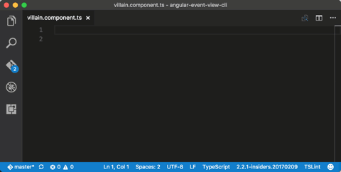

# Angular TypeScript Snippets for VS Code

**Now Updated for Angular 7.0.0 release**

This extension for Visual Studio Code adds snippets for Angular for TypeScript and HTML.

See the [CHANGELOG](CHANGELOG.md) for the latest changes

## Usage

Type part of a snippet, press `enter`, and the snippet unfolds.

### Command Palette Commands

| Command                                              | Purpose                     |
| ---------------------------------------------------- | --------------------------- |
| express: Add simple Express server file to workspace | Adds Node.js express server |

### TypeScript Angular Snippets

| Snippet                      | Purpose                                                      |
| ---------------------------- | ------------------------------------------------------------ |
| `a-component`                | component                                                    |
| `a-component-inline`         | component with inline template                               |
| `a-component-root`           | root app component                                           |
| `a-directive`                | directive                                                    |
| `a-guard-can-activate`       | `CanActivate` guard                                          |
| `a-guard-can-activate-child` | `CanActivateChild` guard                                     |
| `a-guard-can-deactivate`     | `CanDeactivate` guard                                        |
| `a-guard-can-load`           | `CanLoad` guard                                              |
| `a-httpclient-get`           | `httpClient.get` with Rx Observable                          |
| `a-http-interceptor`         | Empty Angular `HttpInterceptor` for `HttpClient`             |
| `a-http-interceptor-headers` | Angular `HttpInterceptor` that sets headers for `HttpClient` |
| `a-http-interceptor-logging` | Angular `HttpInterceptor` that logs traffic for `HttpClient` |
| `a-module`                   | module                                                       |
| `a-module-root`              | root app module                                              |
| `a-module-routing`           | routing module file (forChild)                               |
| `a-ngrx-data-store-module`   | create an NgRx Data store module                             |
| `a-ngrx-data-entity-metadata` | create the entity metadata for NgRx                         |
| `a-ngrx-data-entity-collection-data-service` | create a data service using NgRx             |
| `a-output-event`             | `@Output` event and emitter                                  |
| `a-pipe`                     | pipe                                                         |
| `a-rxjs-import`              | import RxJs features                                         |
| `a-rxjs-operators`           | import RxJs opertors                                         |
| `a-route-path-404`           | 404 route path                                               |
| `a-route-path-default`       | default route path                                           |
| `a-route-path-with-children` | route path with children                                     |
| `a-route-path-eager`         | eager route path                                             |
| `a-route-path-lazy`          | lazy route path                                              |
| `a-router-events`            | listen to one or more router events                          |
| `a-route-params-subscribe`   | subscribe to route parameters                                |
| `a-service`                  | service                                                      |
| `a-service-httpclient`       | service with `HttpClient`                                    |
| `a-ctor-skip-self`           | angular `NgModule`'s `skipself` constructor                  |
| `a-subscribe`                | Rx Observable subscription                                   |

### Dockerfile Snippets

| Snippet                           | Purpose                                      |
| --------------------------------- | -------------------------------------------- |
| `docker-angular-node-multi-stage` | Multi-stage Dockerfile for Node with Angular |

### JavaScript Snippets

| Snippet            | Purpose                |
| ------------------ | ---------------------- |
| `ex-simple-server` | Node.js Express Server |

### HTML Snippets

| Snippet              | Purpose                                    |
| -------------------- | ------------------------------------------ |
| `a-class`            | `[class]` binding                          |
| `a-select`           | `<select>` control                         |
| `a-style`            | `[style]` binding                          |
| `a-ngClass`          | `ngClass`                                  |
| `a-ngFor`            | `*ngFor`                                   |
| `a-ngForAsync`       | `*ngFor` with async                        |
| `a-ngFor-trackBy`    | `*ngFor` with trackBy                      |
| `a-formControlName`  | `formControlName`                          |
| `a-formGroup`        | `formGroup`                                |
| `a-formGroupName`    | `formGroupName`                            |
| `a-ngIf`             | `*ngIf`                                    |
| `a-ngIfElse`         | `*ngIf` with `else`                        |
| `a-ngModel`          | `ngModel`                                  |
| `a-routerLink`       | `routerLink`                               |
| `a-routerLink-param` | `routerLink` with a route parameter        |
| `a-ngStyle`          | `ngStyle`                                  |
| `a-ngSwitch`         | `ngSwitch`                                 |
| `a-prej`             | show the JSON form of a model              |
| `a-preja`            | show the JSON form of a model, using async |

Alternatively, press `Ctrl`+`Space` (Windows, Linux) or `Cmd`+`Space` (OSX) to activate snippets from within the editor.

## Installation

1.  Install Visual Studio Code 1.10.0 or higher
1.  Launch Code
1.  From the command palette `Ctrl`-`Shift`-`P` (Windows, Linux) or `Cmd`-`Shift`-`P` (OSX)
1.  Select `Install Extension`
1.  Choose the extension
1.  Reload Visual Studio Code
