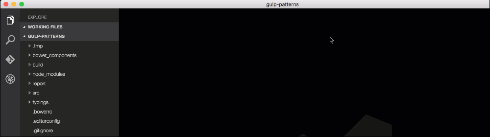

# Angular 2 TypeScript Snippets for VS Code

This extension for Visual Studio Code adds snippets for Angular 2 for TypeScript and HTML.


## Usage
Type part of a snippet, press `enter`, and the snippet unfolds.

### TypeScript Snippets
```typescript
ng2-bootstrap       // Angular 2 bootstraping, for main.ts
ng2-component       // Angular 2 component
ng2-component-root  // Angular 2 root app component
ng2-http-get        // Angular 2 http.get with Rx Observable
ng2-module          // Angular 2 root app module
ng2-module-root     // Angular 2 module
ng2-pipe            // Angular 2 pipe
ng2-routing         // Angular 2 routing
ng2-service         // Angular 2 service
ng2-subscribe       // Angular 2 Rx Observable subscription
```

###HTML Snippets
```html
ng2-ngClass
ng2-ngFor
ng2-ngIf
ng2-ngModel
ng2-routerLink
ng2-ngStyle
ng2-ngSwitch
```

Alternatively, press `Ctrl`+`Space` (Windows, Linux) or `Cmd`+`Space` (OSX) to activate snippets from within the editor.

## Installation

1. Install Visual Studio Code 0.10.1 or higher
2. Launch Code
3. From the command palette `Ctrl`-`Shift`-`P` (Windows, Linux) or `Cmd`-`Shift`-`P` (OSX)
4. Select `Install Extension`
5. Choose the extension
6. Reload Visual Studio Code


