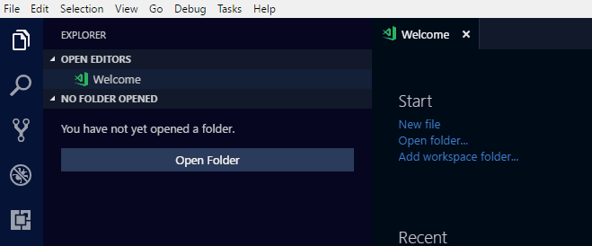

# Angular 2 TypeScript Snippets for VS Code

This extension for Visual Studio Code adds snippets for Angular 2 for TypeScript.


## Usage
Type part of a snippet, press `enter`, and the snippet unfolds.

```javascript
a2component-root  // Angular 2 root App component
a2bootstrap     // Angular 2 bootstraping, for main.ts
a2component     // Angular 2 component
a2pipe          // Angular 2 pipe
a2route-config  // Angular 2 @RouteConfig
a2route-path    // Angular 2 routing path
a2service       // Angular 2 service
a2subscribe     // Angular 2 observable subscription
```

Alternatively, press `Ctrl`+`Space` (Windows, Linux) or `Cmd`+`Space` (OSX) to activate snippets from within the editor.

## Installation

1. Install Visual Studio Code 0.10.1 or higher
2. Launch Code
3. From the command palette `Ctrl`-`Shift`-`P` (Windows, Linux) or `Cmd`-`Shift`-`P` (OSX)
4. Select `Install Extension`
5. Choose the extension
6. Reload Visual Studio Code


