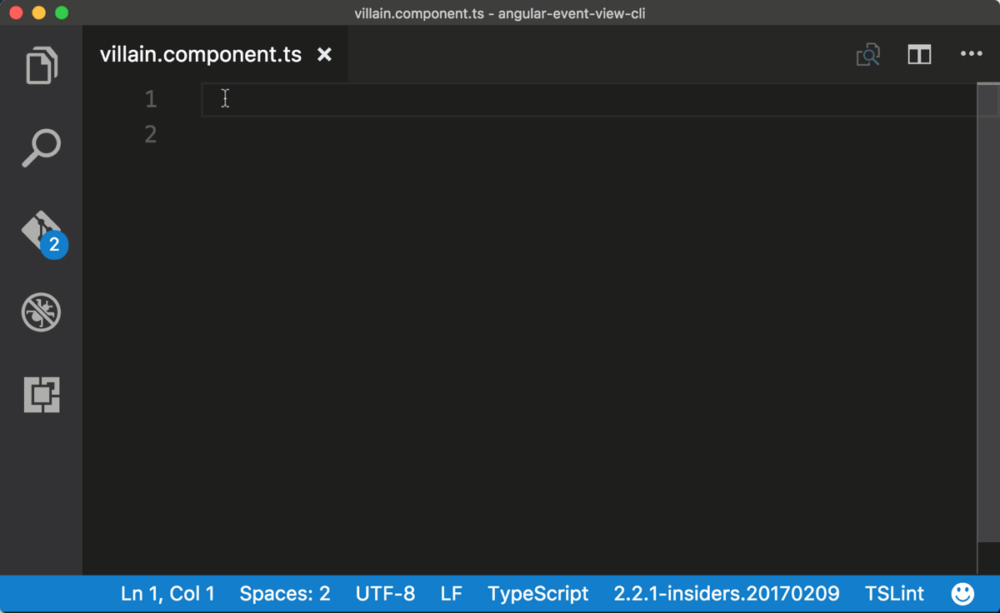

# Angular TypeScript Snippets for VS Code

**Now Updated for Angular 4.0.0 release**

This extension for Visual Studio Code adds snippets for Angular for TypeScript and HTML.



## Usage
Type part of a snippet, press `enter`, and the snippet unfolds.

### TypeScript Snippets
```typescript
a-bootstrap       // Angular bootstrapping, for main.ts
a-component       // Angular component
a-component-root  // Angular root app component
a-directive       // Angular directive
a-http-get        // Angular http.get with Rx Observable
a-module          // Angular module
a-module-root     // Angular root app module
a-pipe            // Angular pipe
a-routing         // Angular routing
a-service         // Angular service
a-subscribe       // Angular Rx Observable subscription
```

###HTML Snippets
```html
a-ngClass
a-ngFor
a-ngForAsync
a-ngIf
a-ngIfElse
a-ngModel
a-routerLink
a-ngStyle
a-ngSwitch
a-prej
a-preja
```

Alternatively, press `Ctrl`+`Space` (Windows, Linux) or `Cmd`+`Space` (OSX) to activate snippets from within the editor.

## Installation

1. Install Visual Studio Code 0.10.1 or higher
2. Launch Code
3. From the command palette `Ctrl`-`Shift`-`P` (Windows, Linux) or `Cmd`-`Shift`-`P` (OSX)
4. Select `Install Extension`
5. Choose the extension
6. Reload Visual Studio Code


